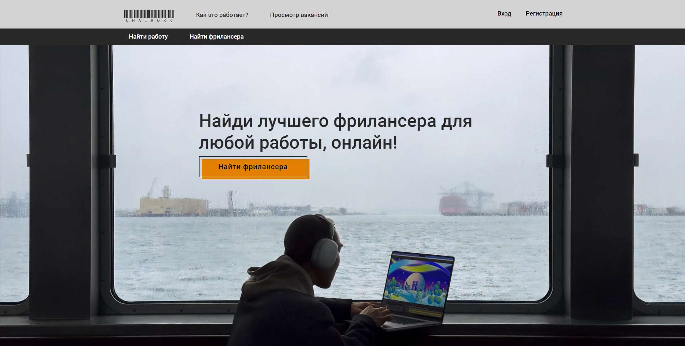

# Разработка фриланс-платформы

♦ Основные функции веб-приложения:

* Создание и редактирования профиля;
* Создание вакансии;
* Просмотр, редактирование и удаление своих вакансий;
* Просмотр доступных вакансий;
* Фильтр и поиска вакансий;
* Уведомление о новых откликах;
* Управление откликами;

